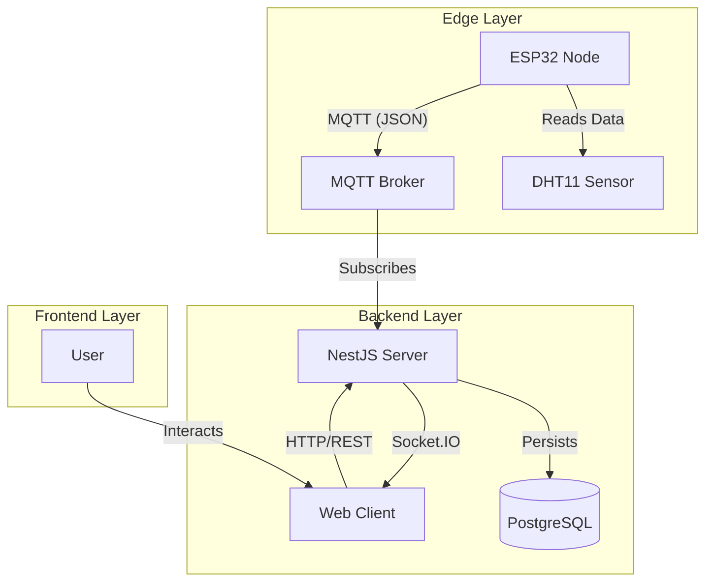

# HeatSync

Real-Time IoT Environmental Monitoring System

## Abstract

HeatSync is a full-stack Internet of Things (IoT) solution designed for the real-time monitoring and analysis of environmental conditions (temperature and humidity) within complex building infrastructures. The system employs a distributed architecture comprising low-power edge devices, a centralized message broker, and a reactive web dashboard to ensure scalable and reliable data acquisition.

## System Architecture

The HeatSync system operates on a publish-subscribe model to decouple data acquisition from data processing and visualization.

### Data Flow

1.  **Acquisition**: The ESP32 microcontroller polls the DHT11 sensor at a configurable interval.
2.  **Transmission**: Telemetry data (Device ID, Temperature, Humidity, Timestamp) is serialized into JSON and published to the `heatsync/telemetry` MQTT topic.
3.  **Ingestion**: The NestJS backend subscribes to the telemetry topic. Upon receiving a message, it validates the payload and checks for alert thresholds.
4.  **Persistence**: Validated data is stored in a PostgreSQL database using Drizzle ORM for historical analysis.
5.  **Broadcast**: The backend pushes the new data point to connected frontend clients via WebSocket (Socket.IO) for real-time visualization.

## Hardware Layer

The edge component is built on the **ESP32** microcontroller, chosen for its dual-core architecture and integrated Wi-Fi/Bluetooth capabilities.

- **Microcontroller**: ESP32-WROOM-32
- **Sensor**: DHT11 (Temperature & Humidity)
- **Protocol**: MQTT over TCP/IP
- **Firmware Logic**:
  - Network provisioning and reconnection strategies.
  - NTP time synchronization for accurate timestamping.
  - Deep sleep capabilities (planned) for power optimization.

## Software Layer

### Backend (NestJS)

The backend is a modular application built with **NestJS**, providing a robust architecture for handling IoT streams.

- **MQTT Service**: Manages connection to the broker and handles incoming telemetry.
- **WebSocket Gateway**: Manages real-time bidirectional communication with the frontend.
- **Alert System**: Evaluates incoming data against user-defined thresholds to trigger notifications.
- **Database**: **PostgreSQL** managed via **Drizzle ORM**. The schema supports a hierarchical location model:
  $$Building \rightarrow Sector \rightarrow Floor \rightarrow Room \rightarrow Device$$

### Frontend (Next.js)

The user interface is a **Next.js** application focusing on data visualization and device management.

- **Real-Time Dashboard**: Updates instantly as data arrives via WebSockets.
- **Hierarchical Filtering**: Allows users to drill down data from an entire building to a specific room.
- **Tech Stack**: React, Tailwind CSS, shadcn/ui.

## Key Features

- [x] **Real-time dashboard**: Live updates with Socket.IO.
- [x] **Hierarchical device filtering**: $Building \rightarrow Sector \rightarrow Floor \rightarrow Room \rightarrow Device$
- [x] **Alert system**: Threshold violations for temperature/humidity.
- [x] **Authentication**: Secure access via Supabase Auth.
- [ ] **Data export**: Export capabilities for selected date ranges.

## Tech Stack

| Category          | Technology                                                      |
| ----------------- | --------------------------------------------------------------- |
| **Frontend**      | [Next.js](https://nextjs.org/docs), [React.js](https://react.dev/), [shadcn/ui](https://ui.shadcn.com/) |
| **Backend**       | [NestJS](https://docs.nestjs.com/), [Socket.io](https://socket.io/), [Drizzle ORM](https://orm.drizzle.team/docs/get-started) |
| **Device / Firmware** | ESP32 with [PlatformIO](https://docs.platformio.org/en/latest/) |
| **Database**      | [PostgreSQL](https://www.postgresql.org/)                       |
| **MQTT**          | [Mosquitto MQTT](https://mosquitto.org/)                        |
| **Email API**     | [Resend](https://resend.com/home)                               |
| **Authentication**| [Supabase Auth](https://supabase.com/docs/guides/auth)          |
| **Hosting**       | [Render](https://render.com/docs), [Vercel](https://vercel.com/docs), [Supabase](https://supabase.com/docs), [HiveMQ](https://docs.hivemq.com/hivemq-cloud/) |

## Research & Future Work

This project aims to address several critical challenges in deploying IoT systems in real-world scenarios:

1.  **Extreme Environment Operation**:
    - Validating ESP32 stability and sensor accuracy in sub-zero temperatures (e.g., industrial freezers).
    - Analyzing battery performance and discharge rates in cold environments.

2.  **Network Reliability in Restricted Environments**:
    - Overcoming connectivity issues in corporate networks with strict firewalls and proxy configurations.
    - Evaluating fallback communication protocols (LoRaWAN, Cellular) for redundancy.

3.  **Data Integrity & Redundancy**:
    - Implementing local buffering on the ESP32 to prevent data loss during network outages.
    - Synchronization algorithms to upload buffered data upon reconnection.

4.  **Regulatory Compliance**:
    - Ensuring hardware compliance with telecommunications standards (e.g., ANATEL).
    - Adhering to data storage and privacy regulations for research data.

